## 🎮 TOWER DEFENSE : S2 - IMAC

**D'après le Template de [Enguerrand Desmet](https://github.com/dsmtE/OpenGL-Template).**

🎓 _DE SANTIS Léo + DOUBLAL Anass + DUPUIS Maxence._\
:books: Librairie / Langage : **OpenGL / C++**\
:computer: Développé sur : **MacOS / Windows**
<br />

<div align="center">
  <a href="https://github.com/othneildrew/Best-README-Template">
    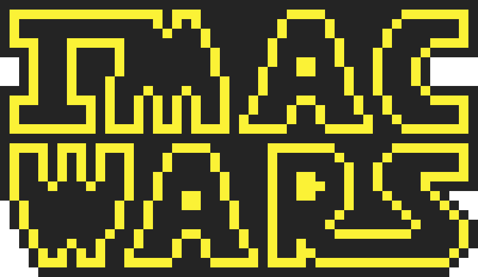
  </a>

  <h3 align="center">Tower Defense</h3>

  <p align="center">
    Projet de fin d'année d'IMAC 1
</div>

:arrow_right: [Sujet du projet](doc/pdf/TDIMAC_SUBJECT.pdf)\
:arrow_right: [Guide du jeu (PDF)](doc/pdf/IMAC_WARS_Tutorial.pdf)


<!-- TABLE OF CONTENTS -->
<details>
  <summary>Sommaire</summary>
  <ol>
    <li>
      <a href="#one-introduction">Introduction</a>
      <ul>
        <li><a href="#pushpin-concept">Concept</a></li>
        <li><a href="#mahjong-thème">Thème</a></li>
        <li><a href="#dart-objectif-du-rapport">Objectif du rapport</a></li>
      </ul>
    </li>
    <li><a href="#two-mécaniques">Mécaniques</a>
        <ul>
        <li><a href="#mag-généralités">Généralités</a></li>
        <li><a href="#memo-fichier-itd">Fichier ITD</a></li>
        <li><a href="#japan-carte">Carte</a></li>
        <li><a href="#rocket-ennemis">Ennemis</a></li>
        <li><a href="#ocean-vagues">Vagues</a></li>
        <li><a href="#tokyo_tower-tours">Tours</a></li>
        <li><a href="#tv-ui">UI</a></li>
      </ul>
      </li>
   <li><a href="#three-améliorations">Améliorations</a>
      </li>
    <li>
    <a href="#four-conclusion">Conclusion</a>
          </li>
      </ul>
  
  </ol>
</details>

<!-- ABOUT THE PROJECT -->

# :one: Introduction

Dans ce projet de fin d'année, nous avions comme exercice de réaliser un jeu de Tower Defense en OpenGL/C++.

Nous sommes trois à avoir travaillés sur ce projet.

## :pushpin: Concept

L'objectif principal était de concevoir un jeu fonctionnel. Cependant, nous avions à cœur de rendre ce projet plus ouvert et accessible, permettant à chacun de personnaliser le jeu et adapter la difficulté.

Nous souhaitons vous offrir la possibilité de jouer facilement vous-même à votre propre version d'IMAC WARS Tower Defense. Le jeu a été conçu de manière à ce que, muni d'une carte, d'un fichier d'informations, et de quelques fonctions, vous puissiez créer votre propre carte et adapter les niveaux en jouant sur les paramètres des vagues.

Ainsi, notre projet vise non seulement à fournir une expérience de jeu captivante, mais également à donner aux utilisateurs les outils nécessaires pour personnaliser et enrichir leur propre version du jeu, rendant l'aventure encore plus engageante et personnelle.

Il s'agit finalement pour l'utilisateur, de suivre un guide d'utilisation simple, pour lui permettre de créer son propre jeu !

## :mahjong: Thème

Avant de nous lancer dans le développement du code, nous avons d'abord réfléchi à un thème qui se prêterait au mieux au style du Tower Defense. Nous avons choisi d'adapter la scène finale de l'épisode IV de Star Wars "Un Nouvel Espoir". Cette scène emblématique montre des escadrons de l'Alliance Rebelle tentant désespérément de détruire l'Étoile de la Mort.

Dans notre adaptation, le joueur incarne les forces de l'Empire. Sa mission sera de défendre l'Étoile de la Mort contre les vagues de Rebelles en plaçant des tourelles de différents types pour empêcher les vaisseaux rebelles d'atteindre le réacteur et de le faire exploser.

Ce projet nous semblait extrêmement ambitieux à première vue. Heureusement, la Force était avec nous !

## :dart: Objectif du rapport

Ce rapport a pour objectif de développer et d'illustrer notre raisonnement dans la conception du Tower Defense. Il ne s'agit pas de décrire dans les moindres détails le code du jeu, mais de comprendre le raisonnement et les principaux éléments implémentés. Si vous souhaitez des détails supplémentaires, n'hésitez pas à regarder le code !

Un [guide d'utilisation](doc/pdf/IMAC_WARS_Tutorial.pdf) est à votre disposition pour vous permettre d'accéder aux règles, caractéristiques et commandes du jeu.

:two: Nous expliquerons dans un premier temps l'implémentation des différents éléments essentiels au bon déroulement du jeu.\
:three: Ensuite, nous présenterons les diverses améliorations apportées pour rendre le jeu plus immersif et captivant.\
:four: Enfin, nous conclurons en portant un regard critique sur le travail accompli et sur les potentielles améliorations à apporter.\

<!-- GETTING STARTED -->

# :two: Mécaniques

## :mag: Généralités

> Arborescence simplifiée des principaux fichiers et dépendances.

```text
Game
└── TowerDefense
    ├── Map
    |    ├── Cell
    |    └── Graph
    ├── Base
    ├── Tower
    |    └── Bullet
    ├── Enemy
    ├── Wave
    └── UI

```

> :warning: Ce rapport a été fait en parallèle de l'implémentation du jeu, il se peut que certains éléments du code n'apparaissent pas dans les captures. N'hésitez pas à vous référez au code si besoin.

`Game` représente le **fichier principal** du jeu. Toutes ses fonctions possèdent un `TD` (structure TowerDefense).
Seules les fonctions de `Game` sont utilisées dans `App` (Application).

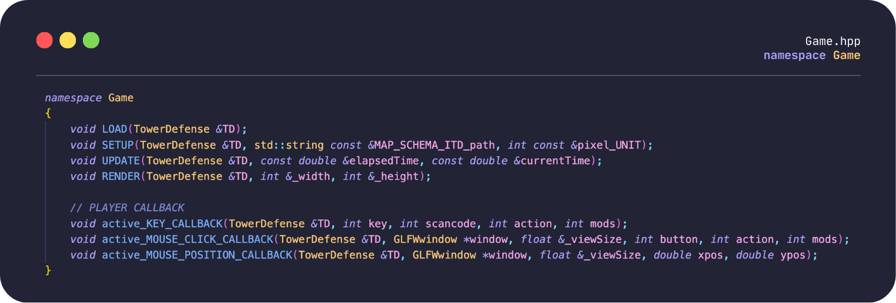

> Les 4 premières fonctions sont celles qui permettent de faire fonctionner l'affichage des éléments du jeu.

**1. LOAD** : Charge toutes les textures une seule fois dans un tableau de texture appelé au tout début de l'application. Charge aussi tous les sons.

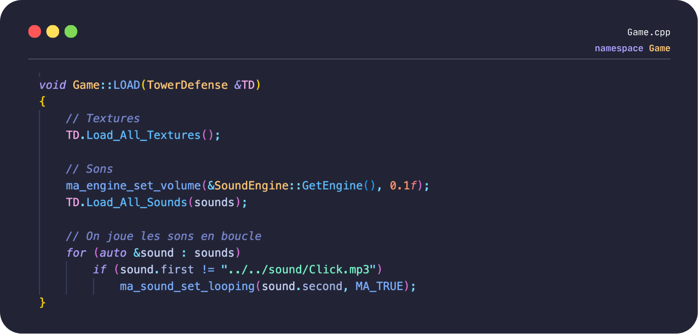

**2. SETUP** : Appels successifs et ordonnés de méthodes permettant de récupérer et de traiter l'information pour :

- Afficher la carte.
- Stocker différentes données telles que les tours, ennemis et vagues.
- Afficher l'interface utilisateur.

Elle prend le chemin vers le fichier de la map en pixel, ainsi que la taille de la map en pixel (width ou height).

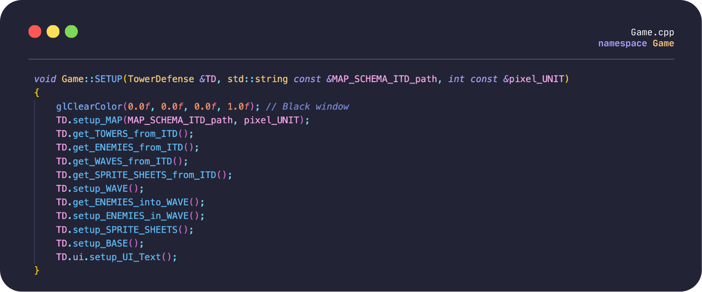

**3. UPDATE** : Permet de gérer les déplacements d'ennemis, l'enchainement des différentes vagues et de mettre à jour l'état du jeu.
C'est là que le temps devient important !

- _elapsedTime_ : essentiel pour rendre les déplacements fluides et uniformes.
- _currentTime_ : c'est le temps qui s'écoule en secondes au lancement du jeu.

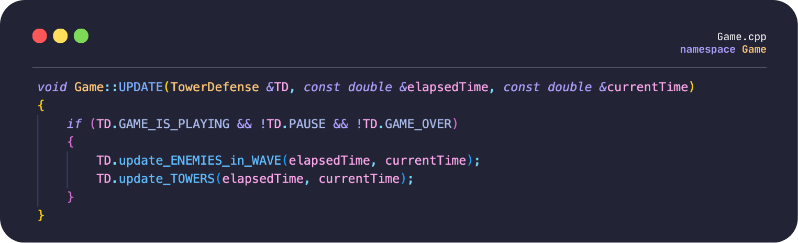

**4. RENDER** : C'est la fonction qui permet l'affichage des éléments de notre jeu !

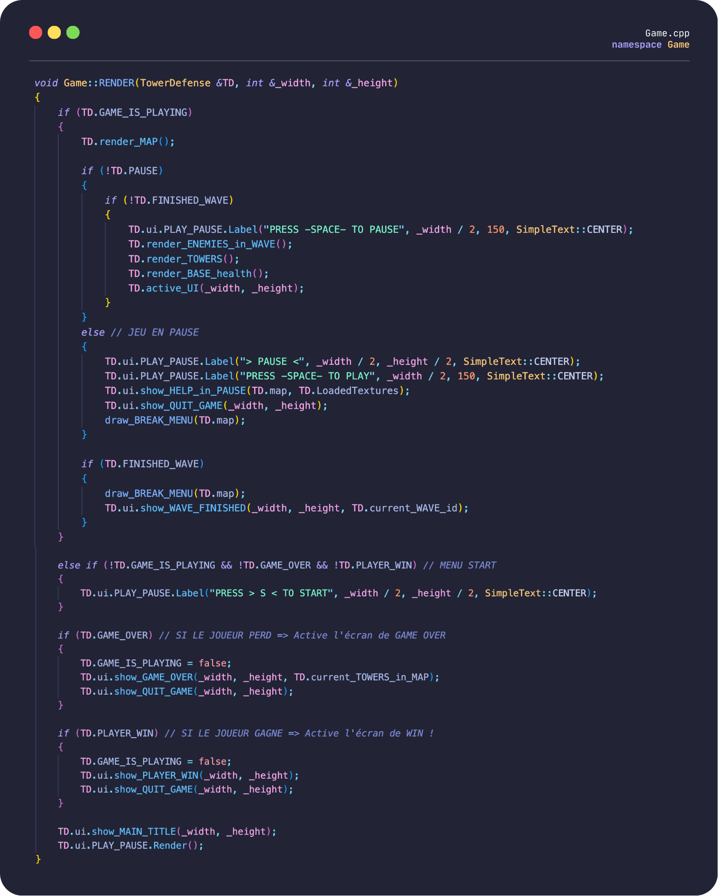

Les 3 fonctions restantes permettent de détecter l'intéraction avec l'utilisateur (Clavier, mouvement, clic de la souris ou du pad).

> :warning: Pour les transformations et affichages d'objets : OpenGL utilise des coordonnées normalisées. C'est à dire que notre fenêtre en pixel, doit être transformée de sorte à ce que ses coordonnées se trouvent sur la plage [-1,1].

Ci-dessous, une partie du code permettant passer des coordonnées de pixels en coordonnées normalisées, puis en coordonnées de carte.

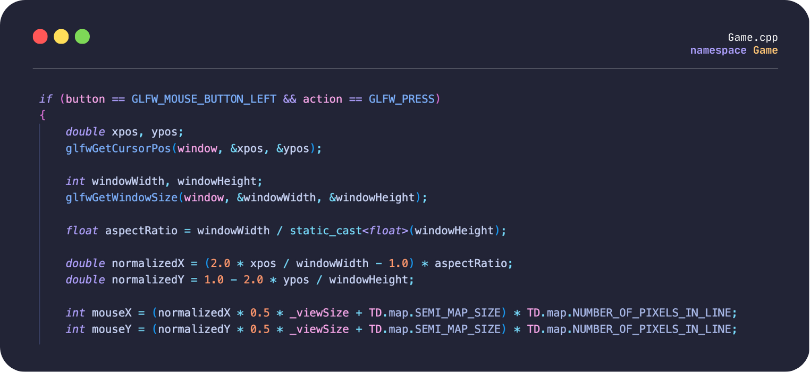

Nous ne rentrerons pas dans le détail des fonctions d'interactions. Retenez simplement l'utilitée des 3 fonctions :

- **active_KEY_CALLBACK(...)** : Déclenche des évênements grâce aux touches du clavier.
- **active_MOUSE_CLICK_CALLBACK(...)** : Déclenche des évênements lorsque le joueur clique sur sa souris (ou pad).
- **active_MOUSE_POSITION_CALLBACK(...)** : Permet de garder en mémoire la position de la souris à chaque instant.

## :memo: Fichier ITD

Pour référencer toutes les données importantes du jeu, nous utilisons des fichier texte avec l'extension `.itd` pour (Imac Tower Defense).
Un fichier nous était imposé pour représenter les différents éléments de notre carte (expliqué plus loin dans le rapport). Ce fichier est lu et analysé par notre application. Ainsi, les fonctions implémentés sont capables de lire et retranscrire à l'écran une importante quantité de données.
Il faut cependant garder en tête que l'utilisateur peut effectuer des erreurs de saisies et donc rendre la lecture impossible ou incorrecte.
Des contrôles ont été effectuées pour permettre la bonne lecture du fichier de map.
Voilà les contrôles du sujet qui étaient nécessaires d'effectuer :

Pour référencer toutes les données importantes du jeu, nous utilisons des fichiers texte avec l'extension .itd pour (Imac Tower Defense). Un fichier nous était imposé pour représenter les différents éléments de notre carte (expliqué plus loin dans le rapport). Ce fichier est lu et analysé par notre application. Ainsi, les fonctions implémentées sont capables de lire et de retranscrire à l'écran une importante quantité de données.

Il faut cependant garder en tête que l'utilisateur peut commettre des erreurs de saisie et donc rendre la lecture impossible ou incorrecte. Des contrôles ont été effectués pour permettre la bonne lecture du fichier de carte. Voici les contrôles du sujet qui étaient nécessaires à effectuer :

1. Toutes les lignes nécessaires sont présentes et dans le bon ordre.
2. Triplet RGB valide pour les couleurs (compris entre 0 et 255).
3. Fichier image existant.
4. Les coordonnées des nœuds sont valides (dans l'image).
5. Existence d'au moins une zone d'entrée et de sortie (cette vérification pourra se faire implicitement lors de la recherche du chemin des ennemis).
6. Existence d'au moins un chemin entre la zone d'entrée et de sortie (cette vérification pourra se faire implicitement lors de la recherche du chemin des ennemis).

- Les vérifications 1, 2, 3 ont été effectuées dans le fichier ITD.cpp.
- Les vérifications 4, 5, 6 ont été effectuées dans le fichier Map.cpp.

Nous avons réutilisé cette logique sur d'autres éléments de notre jeu tels que : les ennemis, vagues, tours, images animées. La volonté est de permettre à l'utilisateur de pouvoir entrer ses données en gérant simplement les fichiers itd ; notre application se charge dynamiquement de récupérer, traiter et afficher l'information. Voici deux exemples de fichiers itd implémentés.

<div style="display: flex;">

<div style="flex: 1; padding-right: 10px;">

```cpp

ITD
#NOMBRE D'ENNEMIS
Enemies 4

#ENEMIES (name, id, health, speed, damage)

type X-Wing 0 40 10 0.5
type Y-Wing 1 70 12 0.75
type A-Wing 2 50 17 1
type Falcon 3 100 20 2
```

</div>
<div style="flex: 1; padding-left: 10px;">

```cpp
ITD
#NOMBRE DE VAGUES
Waves 2


#VAGUES (niveau, nb d'entrée, nb d'ennemi,
temps btw spawn (s), types ennemis)

level 0 2 5 3 0 1
level 1 4 10 2 0 1 2 3
```

</div>
</div>

Ces fichiers représentent les différents types d'ennemis créés et le nombre de vagues que contient le jeu.
On remarque que les vagues prennent une clé secondaire liée à la clé primaire des ennemis, permettant ainsi de faire le lien.

Les fichiers itd optionnels implémentés n'ont cependant pas été "sécurisés" dans la saisie de données.

## :japan: Carte

| Schema : 15x15 px                                          | Carte : 240x240 px                                     |
| ---------------------------------------------------------- | ------------------------------------------------------ |
| 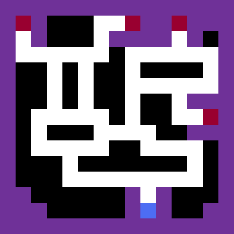 | 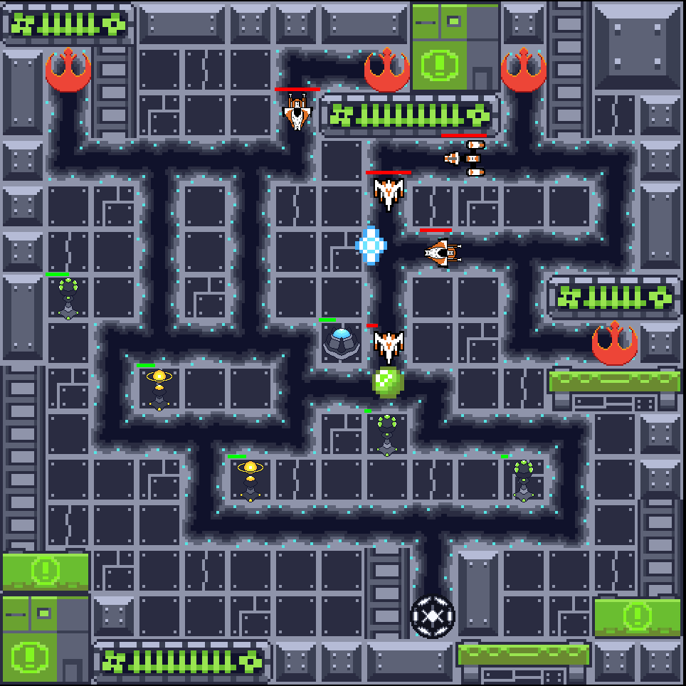 |

> :arrow_right: Zones :\
> :white_circle: = Chemin (path)\
> :red_circle: = Entrée (in)\
> :large_blue_circle: = Sortie (out)\
> :purple_circle: = Interdit (forbidden)\
> :black_circle: = Libre (void)

> :warning: La carte finale est bien découpée en tiles. Nous avons fait le choix d'un point de vu esthétique, de rendre transparente les :purple_circle: & :black_circle: pour pouvoir afficher une map totalement designé en fonction de ces zones, et donc d'avoir un environnement plus détaillé et varié.

La logique de la carte est implémentée dans une structure `Map`.

Cette structure est d'une grande importance dans la suite du développement de notre jeu. En effet, le découpage des tiles constituant la carte représente une bonne base pour l'implémentation des déplacements des ennemis et le positionnement des tours. En d'autres termes, une structure `Map` solide et maintenable est indispensable.

Notre carte se base sur une image de référence appelée par la suite `schema`. Cette image est composée de pixels de couleurs différentes, représentant chacun une information déterminante pour la suite.

Par exemple : si vous voulez construire une `Map` de 15x15 cases, alors le `schema` à analyser sera de 15x15 (véritables) pixels.

Ce `schema` est lu dans un fichier ITD (Image Tower Defense) du type : "mon_schema_15x15.itd". Ce fichier contient :

- Le chemin menant à l'image du `schema`.
- Les couleurs présentes sur l'image.
- Tous les nœuds des chemins (node) avec leur indice, position et connexions.

L'objectif est maintenant de déterminer comment analyser ce fichier pour obtenir une véritable carte !

### Du pixel à la tile !

Une cellule ou case de la carte possède un "squelette" déterminé par `Pixel`.

On détermine une structure `Pixel` qui possède :

- Une position (x, y).
- Une couleur (structure qui prend le triplet de couleur R, G, B).
- Un ou plusieurs types ou états (booléens).
- Des connexions (pointeurs sur les 4 voisins du pixel).

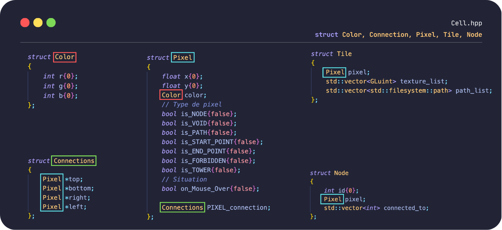

Après avoir déterminé nos structures de base, on va analyser et attribuer à chaque pixel sur le `schéma` (présent dans l'ITD) une structure `Pixel`. Pour ce faire, on va récupérer les données concernant les couleurs et les nodes de l'ITD, pour déterminer le type du pixel !

Toute cette analyse se fait dans le `Game::SETUP(...)` et plus précisemment dans le `setup_MAP(...)` qui prend en paramètre le nom du fichier ITD et le nombre de pixels sur la largeur ou hauteur (peu importe car notre map est carré).


Nous ne rentrerons pas dans le détail de ces fonctions, retenez juste que toutes les données sont stockées dans les `vector` ci-dessous grâce aux appels ordonnés et successifs des méthodes.

```cpp
  struct Map {
  std::vector<Tile> TILES;
  std::vector<Pixel> PIXELS;
  std::vector<Node> NODES;
  Graph::WeightedGraph GRAPH;
  std::vector<std::vector<Node>> SHORTER_PATH_LIST;
  ...
  }
```

A partir de là, nous possédons toutes les `Tile` de notre carte.
Le prochain objectif est de déterminer comment afficher correctement les tiles pour obtenir la carte.

### Afficher la carte !

Si on essaye de dessiner un `quad` en (0,0), on obtient une tile dessinée au centre de notre fenêtre. Or, dans la logique de notre carte, on veut que la case (0,0) soit celle tout en bas à gauche.
Ainsi, comment passer d'un repère à un autre ?
Comment convertir les 4 coins de notre `quad` ?

**Méthode & illustration :**

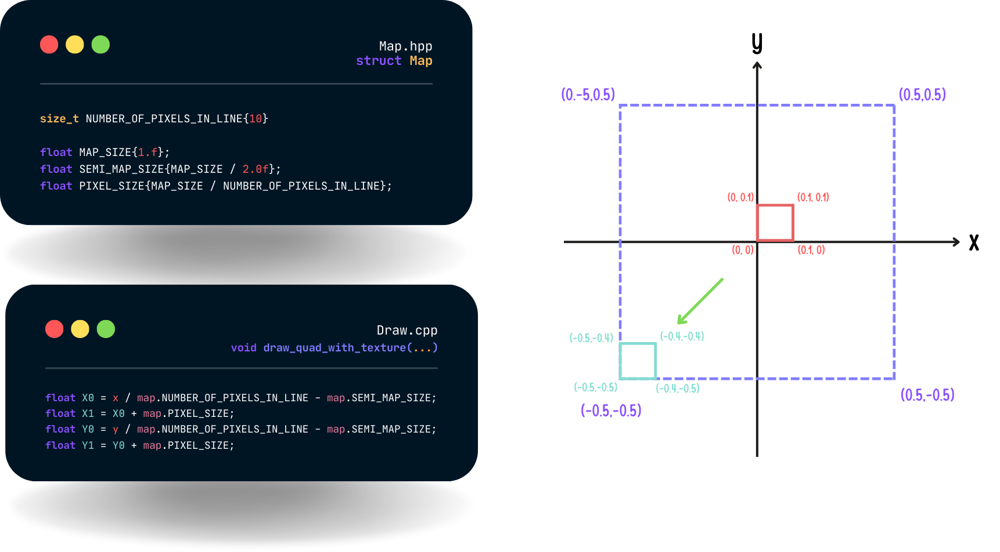

Une fois les formules de conversions obtenues, on peut utiliser `glVertex` et dessiner la tile en bouclant sur le tableau `TILES` contenu par notre structure `Map`.

# :rocket: Ennemis

Il existe dans notre jeu, 4 types d'ennemis différents :

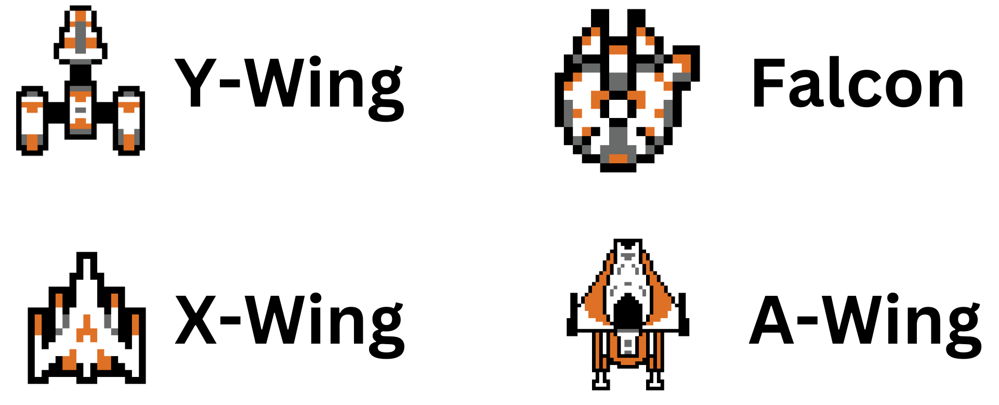

Un ennemi est caractérisé par une structure : `Enemy`

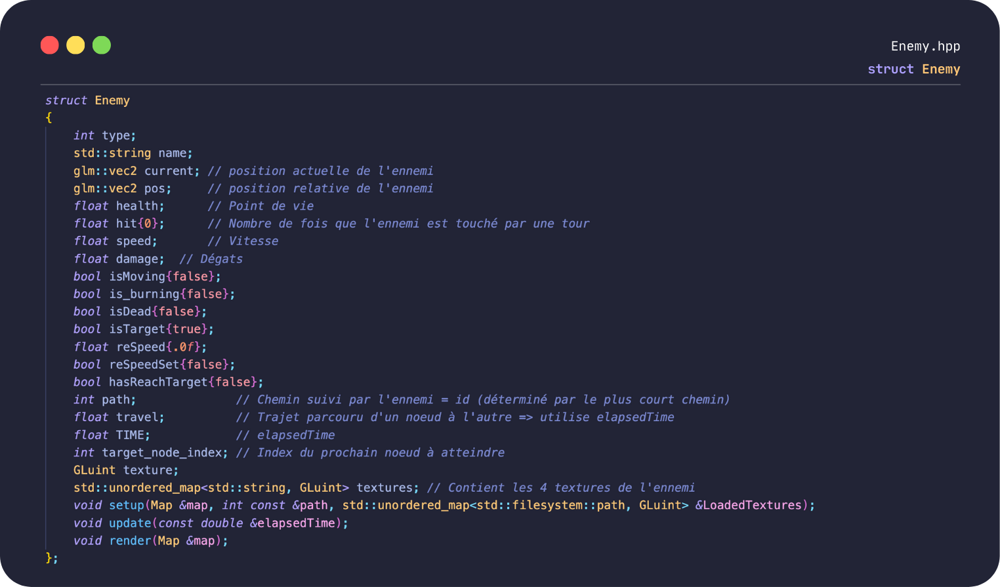

Celui-ci a pour objectif d'infliger des dégâts à la base impériale défendue par le joueur. Les ennemis ont des caractéristiques différentes en fonction de leur type (vitesse, dégâts, points de vie, récompense).

Chaque ennemi parcourt le plus court chemin entre son point de spawn et la base à attaquer. Le spawn est déterminé aléatoirement.

### Déplacement

> Nous allons nous intéresser à l'implémentation du déplacement de l'ennemi.

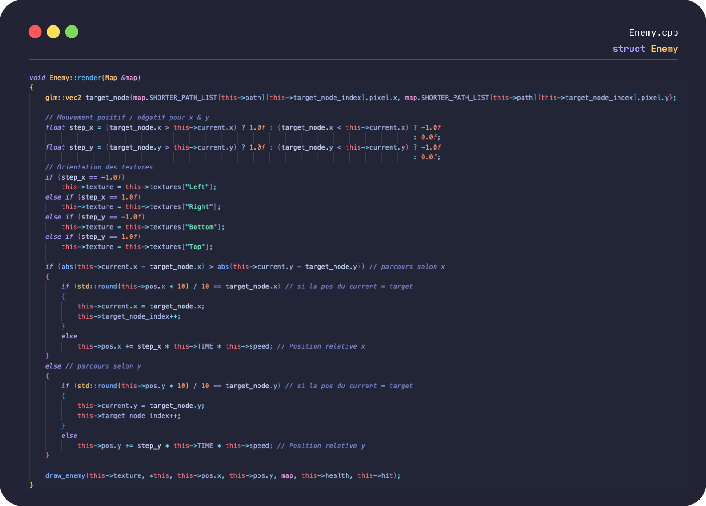

L'idée, c'est de définir une `current position` qui représente le point de départ de l'ennemi (au début). Ce point de départ représente le premier noeud du chemin. On définit également une `target position` qui sera la position ciblée par l'ennemi. Au départ, la position cible est le noeud qui suit le `current`.

On définit également un `step` selon `x` et `y` d'une valeur de +1 ou -1. Ce `step` détermine si on se déplace vers la droite (`step_x` = 1) ou vers la gauche (`step_x` = -1), mais aussi si on se déplace vers le bas (`step_y` = -1) ou vers le haut (`step_y` = 1). Ces valeurs permettent également de déclencher la `texture` correspondant à l'orientation de l'ennemi.

On doit garder à l'esprit que la fonction ci-dessus est appelée en boucle dans `App`. Ainsi, nous n'avons pas besoin d'utiliser de boucle, les conditions suffisent car le rappel successif de notre fonction nous donne un effet de récursion. Si on arrive à mettre à jour nos positions `current` et `target`, c'est gagné.

En effet, quand la position relative de l'ennemi n'est pas égale à la `target`, on incrémente la position en fonction du `step`, de sa `vitesse` et du `temps`.

> :warning: `this->TIME` = `elapsedTime`, mesure le temps écoulé entre chaque frame :arrow_right: permet la fluidité de l'animation et fixe l'indépendance du framerate.

Si l'ennemi atteint la `target`, alors il est au noeud suivant, `current` devient `target` et on incrémente l'`id` de la `target` pour aller chercher le prochain noeud cible.

Ainsi, notre ennemi arrive à se déplacer correctement !

L'ennemi inflige des dégats à la `Base` s'il arrive à l'atteindre. Il suffit simplement de comparer si les positions respectives de l'ennemi et de la base coincident. On décrémente alors la vie de la base en fonction des dégats causés par l'ennemi et on fait disparaitre ce dernier.

# :ocean: Vagues

Une vague possède un certain nombre d'ennemis. Plus les vagues s'enchaînent et plus la difficulté doit augmenter. Ainsi, le nombre d'ennemi augmente, le temps écoulé entre chaque spawn ennemi diminue. Ces paramètres sont évidemment ajustables dans le fichier `ITD`.

On utilise une structure : `Wave`

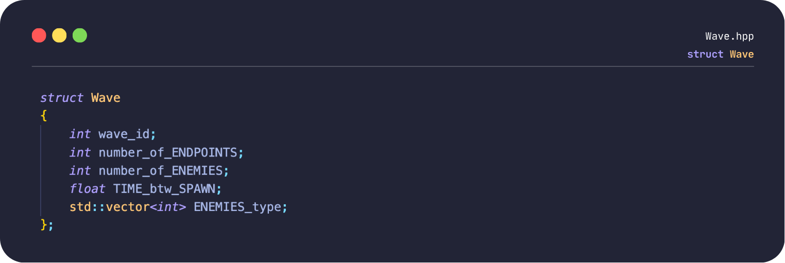

C'est une petite structure. Elle prend :

- un nombre de spawn
- un nombre d'ennemi
- un temps de spawn entre chaque ennemi
- un tableau contenant le type des ennemis contenu dans la vague

Comme vous pouvez le constater, ce n'est pas dans la structure `Wave` que nous récupérons les `Enemy` dans un tableau. Ce processus est effectué plus haut, dans la structure `TowerDefense`.

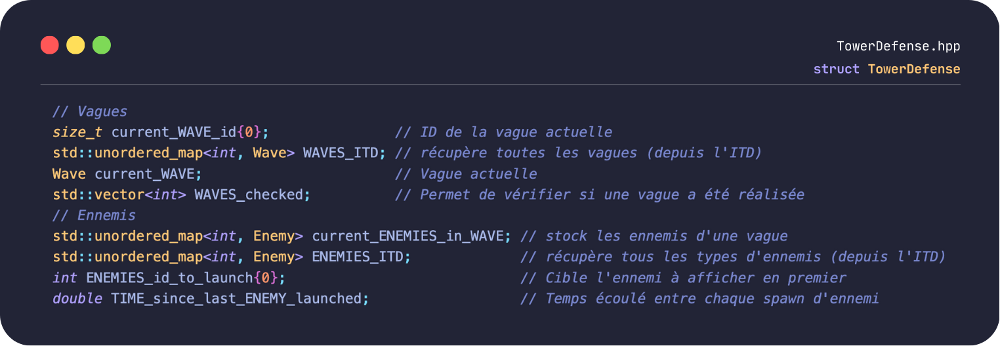

C'est ici que sont stockés les différentes vagues et les différents ennemis dépendants eux-mêmes d'une vague.


1. `setup_WAVE()` permet de récupérer la `current Wave` grâce au `current_WAVE_id` initialisé à 0. Cet `id` est envoyé dans un tableau `WAVES_checked` permettant de stocker les vagues qui ont été chargées.
2. `get_ENEMIES_into_WAVE()` permet de récupérer les ennemis de la vague en court grâce au tableau `number_of_ENEMIES`. On récupère aléatoirement l'id des ennemis. L'id permet de récupérer la structure de l'ennemi correspondante grâce au `ENEMIES_ITD` qui détient toutes les propriétés de chaque type d'ennemi. On insert ensuite dans le `current_ENEMIES_in_WAVE` la structure de l'ennemi.
3. `setup_ENEMIES_in_WAVE()` permet d'initialiser toutes les caractéristiques propres aux ennemis comme leur texture, vitesse, chemin suivi (déterminé aléatoirement).

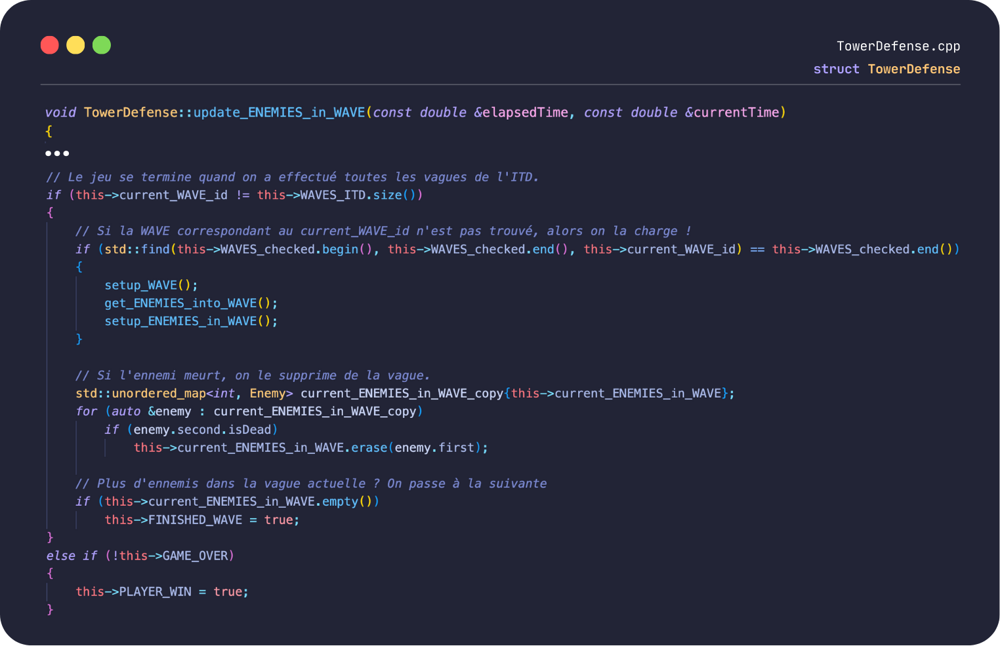

`update_ENEMIES_in_WAVE()` permet comme son nom l'indique de mettre à jour l'état des ennemis dans la vague (spawn, inflammabilité), cette partie du code n'est pas développé dans le rapport. On se concentre ici sur le passage d'une vague à la suivante. Les 3 fonctions développées précédemment sont utilisées dans cette fonction de mise à jour. On vérifie si l'`id` de la `Wave` est présent dans le `WAVES_Checked`, si ce n'est pas le cas, on appelle les fonctions 1,2,3. Si `current_ENEMIES_in_WAVE` est vide, alors on donne la possibilité au joueur de passer à la vague suivante en appuyant sur **Entrée**.

# :tokyo_tower: Tours

[...] Anass

# :tv: UI

Le joueur a la possibilité d'intéragir avec l'application, grâce notamment aux 3 fonctions de callback mentionnées au début du rapport. Il a aussi de nombreuses informations à sa disposition lui permettant de comprendre le fonctionnement et déroulement du jeu.

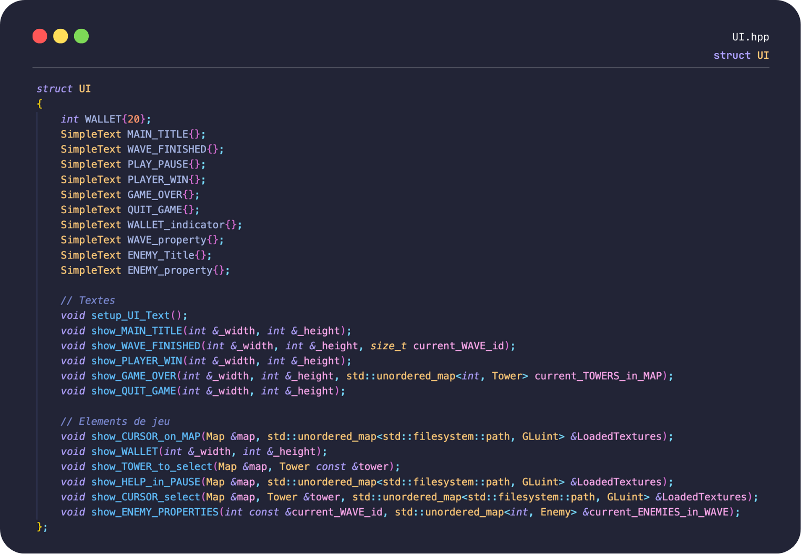

Elements visibles à l'écran :

- Argent disponible.
- Vague en court.
- Point de vie de la base.
- Curseurs intuitifs.

Exemples d'intéractions :

- Possibilité de lancer le jeu, de mettre en pause et de quitter.
- Accès lors de la mise en pause aux caractéristiques des ennemis et tours.
- Possibilité de sélectionner une tour spécifique en fonction de l'argent disponible et de placer celle-ci sur la carte si la case est valide.
- Cliquer sur une tour ou un ennemi pour voir les caractéristiques.

# :three: Améliorations

Cette partie a pour objectif de mentionner les améliorations effectuées par rapport aux règles imposées par le [sujet du projet](doc/pdf/TDIMAC_SUBJECT.pdf).

:white_check_mark: Zones constructibles pour les tours.\
:white_check_mark: Placement intelligent des sprites de chemin.\
:white_check_mark: Sprite animé\
:white_check_mark: Différents types de ennemies avec des caractéristiques différentes.\
:white_check_mark: Différents types de tours avec des caractéristiques différentes.\
:white_check_mark: Visualisation des tirs des tours sur les ennemis.\
:white_check_mark: Créer une zone de sortie ayant des points de vie, encaissant les dégâts des ennemies avant de perdre la partie.\
:eight_spoked_asterisk: Créations de toutes les textures du jeu.\
:heavy_plus_sign: Créations d'ITD supplémentaires (enemy, wave, tower, sprite_sheets).\
:heavy_plus_sign: Utilisations de musiques et effets sonores pour renforcer l'ambiance.

# :four: Conclusion

Nous sommes tout d'abord **fiers** de ce projet.

Ce jeu a été réalisé avec passion et nous avons tous les trois énormément appris. Nous ne pensions pas aller aussi loin dans l'implémentation, mais nous avions réellement envie de développer davantage ce projet. Nous tenons à **remercier notre professeur de programmation** [Enguerrand Desmet](https://github.com/dsmtE), qui a été là quand nous avions besoin d'aide, notamment pour l'utilisation de la librairie audio _miniaudio_, ainsi que pour les problèmes d'affichage liés à la librairie de texte (le jeu ayant principalement été développé sur MacOS avec un écran Retina).

Évidemment, **beaucoup de choses peuvent encore être améliorées**. On peut notamment noter l'absence de vérifications sur les ITD des vagues, des ennemis, des tours et des spritesheets, bien que ces derniers soient une amélioration de notre part. Certaines fonctions mériteraient d'être optimisées, ou certains choix, comme le fait de ne pas intégrer directement un tableau d'ennemis dans la structure `Wave`, pourraient être repensés.

Les principales difficultés rencontrées ont été liées à l'organisation des différents fichiers. Comment s'organiser pour que tout soit bien interconnecté et que la structure du projet reste cohérente ? Gérer l'affichage n'a pas été simple, car entre macOS et Windows, ce dernier était différent (lié à la densité de pixels).

Notre objectif a été de produire le code le plus propre possible dans le temps qui nous était imparti, mais surtout de créer un jeu agréable visuellement auquel on prend plaisir à jouer !

Tout n'a pas été expliqué dans ce rapport car cela aurait pris une éternité. N'hésitez pas à explorer par vous-même ! ;)

**Que la force soit avec vous !**

[Léo DE SANTIS](https://github.com/LaitEauDS)\
[Anass DOUBLAL](https://github.com/AnassDoublal)\
[Maxence DUPUIS](https://github.com/smallboyc)
